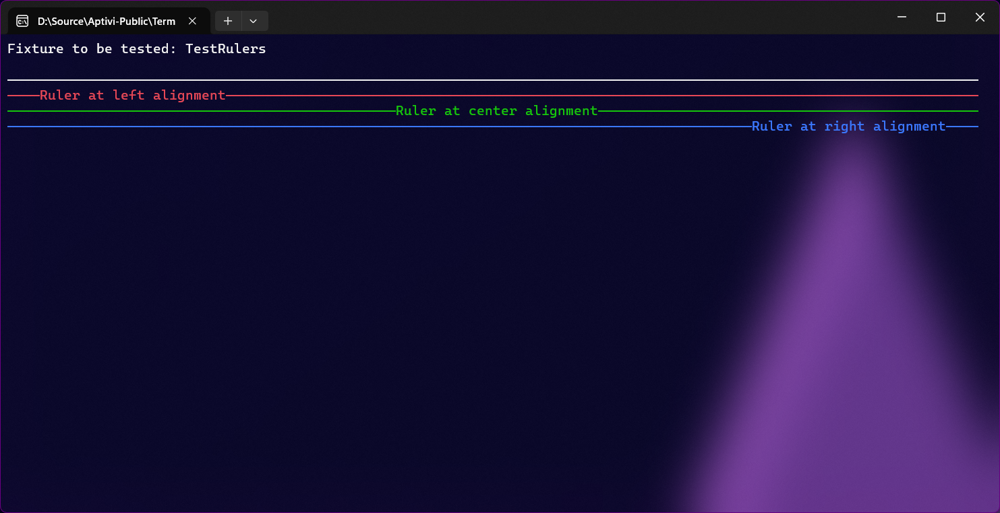

# Artistic

This allows you to draw artistic stuff into the console so that you can build your own interactive console applications easily.

## Border

You can render a nice border to the console either without any text, just a title, a text, or box title and text. You can also customize the borders, such as drop shadows which we'll showcase in the `BoxFrame` renderable.



```csharp
var artistic = new Border()
{
    Left = 2,
    Top = 1,
    InteriorWidth = 20,
    InteriorHeight = 10,
};
TextWriterRaw.WriteRaw(artistic.Render());
```

<figure><figcaption></figcaption></figure>



```csharp
var artistic = new Border()
{
    Left = 2,
    Top = 1,
    InteriorWidth = 20,
    InteriorHeight = 10,
    Title = "Border title",
};
TextWriterRaw.WriteRaw(artistic.Render());
```

<figure><figcaption></figcaption></figure>



```csharp
var artistic = new Border()
{
    Left = 2,
    Top = 1,
    InteriorWidth = 20,
    InteriorHeight = 10,
    Text = "Border text",
};
TextWriterRaw.WriteRaw(artistic.Render());
```

<figure><figcaption></figcaption></figure>



```csharp
var artistic = new Border()
{
    Left = 2,
    Top = 1,
    InteriorWidth = 20,
    InteriorHeight = 10,
    Title = "Border title",
    Text = "Border text",
};
TextWriterRaw.WriteRaw(artistic.Render());
```

<figure><figcaption></figcaption></figure>




You can use the border settings to change the color of the border and to determine whether to display the entire border or not using a set of properties. For example, if you don't want to render the right edge, you can set `BorderRightFrameEnabled` to `false`.


## Box

You can render a box to the terminal easily.

```csharp
var artistic = new Box()
{
    Left = 2,
    Top = 1,
    InteriorWidth = 20,
    InteriorHeight = 10,
    Color = ConsoleColors.Magenta3
};
TextWriterRaw.WriteRaw(artistic.Render());
```

<figure><figcaption></figcaption></figure>

## Box frame

It's basically the same as a border, but without text support and without filling inside the box



```csharp
var artistic = new BoxFrame("")
{
    Left = 2,
    Top = 1,
    InteriorWidth = 20,
    InteriorHeight = 10,
};
TextWriterRaw.WriteRaw(artistic.Render());
```

<figure><figcaption></figcaption></figure>



```csharp
var artistic = new BoxFrame("Text")
{
    Left = 2,
    Top = 1,
    InteriorWidth = 20,
    InteriorHeight = 10,
};
TextWriterRaw.WriteRaw(artistic.Render());
```

<figure><figcaption></figcaption></figure>



```csharp
var artistic = new BoxFrame("")
{
    Left = 2,
    Top = 1,
    InteriorWidth = 20,
    InteriorHeight = 10,
    BackgroundColor = ConsoleColors.Aqua,
    FrameColor = ConsoleColors.Black,
    TitleColor = ConsoleColors.Black,
    DropShadow = true,
    ShadowColor = ConsoleColors.Teal,
};
TextWriterRaw.WriteRaw(artistic.Render());
```

<figure><figcaption></figcaption></figure>



```csharp
var artistic = new BoxFrame("Hello world!")
{
    Left = 2,
    Top = 1,
    InteriorWidth = 20,
    InteriorHeight = 10,
    BackgroundColor = ConsoleColors.Aqua,
    FrameColor = ConsoleColors.Black,
    TitleColor = ConsoleColors.Black,
    DropShadow = true,
    ShadowColor = ConsoleColors.Teal,
};
TextWriterRaw.WriteRaw(artistic.Render());
```

<figure><figcaption></figcaption></figure>



```csharp
TextWriterColor.WriteColor("A simple box frame:", true, new Color(ConsoleColors.Green));
var frame1 = new BoxFrame()
{
    Width = 20,
    Height = 7,
    Left = 2,
    Top = 4,
};
var frame2 = new BoxFrame()
{
    Width = 20,
    Height = 7,
    Left = 24,
    Top = 4,
    Rulers =
    [
        new(3, RulerOrientation.Horizontal),
    ]
};
var frame3 = new BoxFrame()
{
    Width = 20,
    Height = 7,
    Left = 2,
    Top = 13,
    Rulers =
    [
        new(8, RulerOrientation.Vertical),
    ]
};
var frame4 = new BoxFrame()
{
    Width = 20,
    Height = 7,
    Left = 24,
    Top = 13,
    Rulers =
    [
        new(3, RulerOrientation.Horizontal),
        new(8, RulerOrientation.Vertical),
    ]
};
TextWriterRaw.WriteRaw(frame1.Render());
TextWriterRaw.WriteRaw(frame2.Render());
TextWriterRaw.WriteRaw(frame3.Render());
TextWriterRaw.WriteRaw(frame4.Render());
```

<figure><figcaption></figcaption></figure>



```csharp
var frame1 = new BoxFrame()
{
    Width = 20,
    Height = 7,
    Left = 2,
    Top = 4,
};
var frame2 = new BoxFrame()
{
    Width = 20,
    Height = 7,
    Left = 24,
    Top = 4,
    Rulers =
    [
        new(3, RulerOrientation.Horizontal),
    ]
};
var frame3 = new BoxFrame()
{
    Width = 20,
    Height = 7,
    Left = 2,
    Top = 13,
    Rulers =
    [
        new(8, RulerOrientation.Vertical),
    ]
};
var frame4 = new BoxFrame()
{
    Width = 20,
    Height = 7,
    Left = 24,
    Top = 13,
    Rulers =
    [
        new(3, RulerOrientation.Horizontal),
        new(8, RulerOrientation.Vertical),
    ]
};
var frame5 = new BoxFrame()
{
    Width = 20,
    Height = 7,
    Left = 46,
    Top = 4,
    Rulers =
    [
        new(3, RulerOrientation.Horizontal),
        new(8, RulerOrientation.Vertical, 1),
        new(13, RulerOrientation.Vertical, 1, true),
    ]
};
var frame6 = new BoxFrame()
{
    Width = 20,
    Height = 7,
    Left = 46,
    Top = 13,
    Rulers =
    [
        new(16, RulerOrientation.Vertical),
        new(8, RulerOrientation.Vertical),
        new(4, RulerOrientation.Horizontal, 1),
        new(2, RulerOrientation.Horizontal, 2, true),
    ]
};
TextWriterRaw.WriteRaw(frame1.Render());
TextWriterRaw.WriteRaw(frame2.Render());
TextWriterRaw.WriteRaw(frame3.Render());
TextWriterRaw.WriteRaw(frame4.Render());
TextWriterRaw.WriteRaw(frame5.Render());
TextWriterRaw.WriteRaw(frame6.Render());
```

<figure><figcaption></figcaption></figure>



## Canvas

This is your sandbox for your awesome creations. This is done by coloring individual pixels with a color of your choice.



```csharp
var artistic = new Canvas()
{
	Left = 2,
	Top = 2,
	Color = ConsoleColors.Green,
	DoubleWidth = false,
	Transparent = true,
	InteriorWidth = 20,
	InteriorHeight = 20,
	Pixels =
	[
        // Draw the top part of the "T" letter
        new(2, 2) { CellColor = ConsoleColors.Yellow },
		new(3, 2) { CellColor = ConsoleColors.Yellow },
		new(4, 2) { CellColor = ConsoleColors.Yellow },
		new(5, 2) { CellColor = ConsoleColors.Yellow },
		new(6, 2) { CellColor = ConsoleColors.Yellow },
		new(7, 2) { CellColor = ConsoleColors.Yellow },
		new(8, 2) { CellColor = ConsoleColors.Yellow },
		new(9, 2) { CellColor = ConsoleColors.Yellow },
		new(10, 2) { CellColor = ConsoleColors.Yellow },
		new(11, 2) { CellColor = ConsoleColors.Yellow },
		new(12, 2) { CellColor = ConsoleColors.Yellow },
		new(13, 2) { CellColor = ConsoleColors.Yellow },
		new(14, 2) { CellColor = ConsoleColors.Yellow },
		new(15, 2) { CellColor = ConsoleColors.Yellow },
		new(16, 2) { CellColor = ConsoleColors.Yellow },
		new(17, 2) { CellColor = ConsoleColors.Yellow },
		new(18, 2) { CellColor = ConsoleColors.Yellow },
		new(2, 3) { CellColor = ConsoleColors.Yellow },
		new(3, 3) { CellColor = ConsoleColors.Yellow },
		new(4, 3) { CellColor = ConsoleColors.Yellow },
		new(5, 3) { CellColor = ConsoleColors.Yellow },
		new(6, 3) { CellColor = ConsoleColors.Yellow },
		new(7, 3) { CellColor = ConsoleColors.Yellow },
		new(8, 3) { CellColor = ConsoleColors.Yellow },
		new(9, 3) { CellColor = ConsoleColors.Yellow },
		new(10, 3) { CellColor = ConsoleColors.Yellow },
		new(11, 3) { CellColor = ConsoleColors.Yellow },
		new(12, 3) { CellColor = ConsoleColors.Yellow },
		new(13, 3) { CellColor = ConsoleColors.Yellow },
		new(14, 3) { CellColor = ConsoleColors.Yellow },
		new(15, 3) { CellColor = ConsoleColors.Yellow },
		new(16, 3) { CellColor = ConsoleColors.Yellow },
		new(17, 3) { CellColor = ConsoleColors.Yellow },
		new(18, 3) { CellColor = ConsoleColors.Yellow },
        
        // Draw the line of the "T" letter
        new(9, 3) { CellColor = ConsoleColors.Yellow },
		new(9, 4) { CellColor = ConsoleColors.Yellow },
		new(9, 5) { CellColor = ConsoleColors.Yellow },
		new(9, 6) { CellColor = ConsoleColors.Yellow },
		new(9, 7) { CellColor = ConsoleColors.Yellow },
		new(9, 8) { CellColor = ConsoleColors.Yellow },
		new(9, 9) { CellColor = ConsoleColors.Yellow },
		new(9, 10) { CellColor = ConsoleColors.Yellow },
		new(9, 11) { CellColor = ConsoleColors.Yellow },
		new(9, 12) { CellColor = ConsoleColors.Yellow },
		new(9, 13) { CellColor = ConsoleColors.Yellow },
		new(9, 14) { CellColor = ConsoleColors.Yellow },
		new(9, 15) { CellColor = ConsoleColors.Yellow },
		new(9, 16) { CellColor = ConsoleColors.Yellow },
		new(9, 17) { CellColor = ConsoleColors.Yellow },
		new(9, 18) { CellColor = ConsoleColors.Yellow },
		new(9, 19) { CellColor = ConsoleColors.Yellow },
		new(10, 3) { CellColor = ConsoleColors.Yellow },
		new(10, 4) { CellColor = ConsoleColors.Yellow },
		new(10, 5) { CellColor = ConsoleColors.Yellow },
		new(10, 6) { CellColor = ConsoleColors.Yellow },
		new(10, 7) { CellColor = ConsoleColors.Yellow },
		new(10, 8) { CellColor = ConsoleColors.Yellow },
		new(10, 9) { CellColor = ConsoleColors.Yellow },
		new(10, 10) { CellColor = ConsoleColors.Yellow },
		new(10, 11) { CellColor = ConsoleColors.Yellow },
		new(10, 12) { CellColor = ConsoleColors.Yellow },
		new(10, 13) { CellColor = ConsoleColors.Yellow },
		new(10, 14) { CellColor = ConsoleColors.Yellow },
		new(10, 15) { CellColor = ConsoleColors.Yellow },
		new(10, 16) { CellColor = ConsoleColors.Yellow },
		new(10, 17) { CellColor = ConsoleColors.Yellow },
		new(10, 18) { CellColor = ConsoleColors.Yellow },
		new(10, 19) { CellColor = ConsoleColors.Yellow },
		new(11, 3) { CellColor = ConsoleColors.Yellow },
		new(11, 4) { CellColor = ConsoleColors.Yellow },
		new(11, 5) { CellColor = ConsoleColors.Yellow },
		new(11, 6) { CellColor = ConsoleColors.Yellow },
		new(11, 7) { CellColor = ConsoleColors.Yellow },
		new(11, 8) { CellColor = ConsoleColors.Yellow },
		new(11, 9) { CellColor = ConsoleColors.Yellow },
		new(11, 10) { CellColor = ConsoleColors.Yellow },
		new(11, 11) { CellColor = ConsoleColors.Yellow },
		new(11, 12) { CellColor = ConsoleColors.Yellow },
		new(11, 13) { CellColor = ConsoleColors.Yellow },
		new(11, 14) { CellColor = ConsoleColors.Yellow },
		new(11, 15) { CellColor = ConsoleColors.Yellow },
		new(11, 16) { CellColor = ConsoleColors.Yellow },
		new(11, 17) { CellColor = ConsoleColors.Yellow },
		new(11, 18) { CellColor = ConsoleColors.Yellow },
		new(11, 19) { CellColor = ConsoleColors.Yellow },
	]
};
TextWriterRaw.WriteRaw(artistic.Render());
```

<figure><figcaption></figcaption></figure>



```csharp
var artistic = new Canvas()
{
	Left = 2,
	Top = 2,
	Color = ConsoleColors.Green,
	DoubleWidth = false,
	InteriorWidth = 20,
	InteriorHeight = 20,
	Pixels =
	[
        // Draw the top part of the "T" letter
        new(2, 2) { CellColor = ConsoleColors.Yellow },
		new(3, 2) { CellColor = ConsoleColors.Yellow },
		new(4, 2) { CellColor = ConsoleColors.Yellow },
		new(5, 2) { CellColor = ConsoleColors.Yellow },
		new(6, 2) { CellColor = ConsoleColors.Yellow },
		new(7, 2) { CellColor = ConsoleColors.Yellow },
		new(8, 2) { CellColor = ConsoleColors.Yellow },
		new(9, 2) { CellColor = ConsoleColors.Yellow },
		new(10, 2) { CellColor = ConsoleColors.Yellow },
		new(11, 2) { CellColor = ConsoleColors.Yellow },
		new(12, 2) { CellColor = ConsoleColors.Yellow },
		new(13, 2) { CellColor = ConsoleColors.Yellow },
		new(14, 2) { CellColor = ConsoleColors.Yellow },
		new(15, 2) { CellColor = ConsoleColors.Yellow },
		new(16, 2) { CellColor = ConsoleColors.Yellow },
		new(17, 2) { CellColor = ConsoleColors.Yellow },
		new(18, 2) { CellColor = ConsoleColors.Yellow },
		new(2, 3) { CellColor = ConsoleColors.Yellow },
		new(3, 3) { CellColor = ConsoleColors.Yellow },
		new(4, 3) { CellColor = ConsoleColors.Yellow },
		new(5, 3) { CellColor = ConsoleColors.Yellow },
		new(6, 3) { CellColor = ConsoleColors.Yellow },
		new(7, 3) { CellColor = ConsoleColors.Yellow },
		new(8, 3) { CellColor = ConsoleColors.Yellow },
		new(9, 3) { CellColor = ConsoleColors.Yellow },
		new(10, 3) { CellColor = ConsoleColors.Yellow },
		new(11, 3) { CellColor = ConsoleColors.Yellow },
		new(12, 3) { CellColor = ConsoleColors.Yellow },
		new(13, 3) { CellColor = ConsoleColors.Yellow },
		new(14, 3) { CellColor = ConsoleColors.Yellow },
		new(15, 3) { CellColor = ConsoleColors.Yellow },
		new(16, 3) { CellColor = ConsoleColors.Yellow },
		new(17, 3) { CellColor = ConsoleColors.Yellow },
		new(18, 3) { CellColor = ConsoleColors.Yellow },
        
        // Draw the line of the "T" letter
        new(9, 3) { CellColor = ConsoleColors.Yellow },
		new(9, 4) { CellColor = ConsoleColors.Yellow },
		new(9, 5) { CellColor = ConsoleColors.Yellow },
		new(9, 6) { CellColor = ConsoleColors.Yellow },
		new(9, 7) { CellColor = ConsoleColors.Yellow },
		new(9, 8) { CellColor = ConsoleColors.Yellow },
		new(9, 9) { CellColor = ConsoleColors.Yellow },
		new(9, 10) { CellColor = ConsoleColors.Yellow },
		new(9, 11) { CellColor = ConsoleColors.Yellow },
		new(9, 12) { CellColor = ConsoleColors.Yellow },
		new(9, 13) { CellColor = ConsoleColors.Yellow },
		new(9, 14) { CellColor = ConsoleColors.Yellow },
		new(9, 15) { CellColor = ConsoleColors.Yellow },
		new(9, 16) { CellColor = ConsoleColors.Yellow },
		new(9, 17) { CellColor = ConsoleColors.Yellow },
		new(9, 18) { CellColor = ConsoleColors.Yellow },
		new(9, 19) { CellColor = ConsoleColors.Yellow },
		new(10, 3) { CellColor = ConsoleColors.Yellow },
		new(10, 4) { CellColor = ConsoleColors.Yellow },
		new(10, 5) { CellColor = ConsoleColors.Yellow },
		new(10, 6) { CellColor = ConsoleColors.Yellow },
		new(10, 7) { CellColor = ConsoleColors.Yellow },
		new(10, 8) { CellColor = ConsoleColors.Yellow },
		new(10, 9) { CellColor = ConsoleColors.Yellow },
		new(10, 10) { CellColor = ConsoleColors.Yellow },
		new(10, 11) { CellColor = ConsoleColors.Yellow },
		new(10, 12) { CellColor = ConsoleColors.Yellow },
		new(10, 13) { CellColor = ConsoleColors.Yellow },
		new(10, 14) { CellColor = ConsoleColors.Yellow },
		new(10, 15) { CellColor = ConsoleColors.Yellow },
		new(10, 16) { CellColor = ConsoleColors.Yellow },
		new(10, 17) { CellColor = ConsoleColors.Yellow },
		new(10, 18) { CellColor = ConsoleColors.Yellow },
		new(10, 19) { CellColor = ConsoleColors.Yellow },
		new(11, 3) { CellColor = ConsoleColors.Yellow },
		new(11, 4) { CellColor = ConsoleColors.Yellow },
		new(11, 5) { CellColor = ConsoleColors.Yellow },
		new(11, 6) { CellColor = ConsoleColors.Yellow },
		new(11, 7) { CellColor = ConsoleColors.Yellow },
		new(11, 8) { CellColor = ConsoleColors.Yellow },
		new(11, 9) { CellColor = ConsoleColors.Yellow },
		new(11, 10) { CellColor = ConsoleColors.Yellow },
		new(11, 11) { CellColor = ConsoleColors.Yellow },
		new(11, 12) { CellColor = ConsoleColors.Yellow },
		new(11, 13) { CellColor = ConsoleColors.Yellow },
		new(11, 14) { CellColor = ConsoleColors.Yellow },
		new(11, 15) { CellColor = ConsoleColors.Yellow },
		new(11, 16) { CellColor = ConsoleColors.Yellow },
		new(11, 17) { CellColor = ConsoleColors.Yellow },
		new(11, 18) { CellColor = ConsoleColors.Yellow },
		new(11, 19) { CellColor = ConsoleColors.Yellow },
	]
};
TextWriterRaw.WriteRaw(artistic.Render());
```

<figure><figcaption></figcaption></figure>



```csharp
var artistic = new Canvas()
{
	Left = 2,
	Top = 2,
	Color = ConsoleColors.Green,
	Transparent = true,
	InteriorWidth = 20,
	InteriorHeight = 20,
	Pixels =
	[
        // Draw the top part of the "T" letter
        new(2, 2) { CellColor = ConsoleColors.Yellow },
		new(3, 2) { CellColor = ConsoleColors.Yellow },
		new(4, 2) { CellColor = ConsoleColors.Yellow },
		new(5, 2) { CellColor = ConsoleColors.Yellow },
		new(6, 2) { CellColor = ConsoleColors.Yellow },
		new(7, 2) { CellColor = ConsoleColors.Yellow },
		new(8, 2) { CellColor = ConsoleColors.Yellow },
		new(9, 2) { CellColor = ConsoleColors.Yellow },
		new(10, 2) { CellColor = ConsoleColors.Yellow },
		new(11, 2) { CellColor = ConsoleColors.Yellow },
		new(12, 2) { CellColor = ConsoleColors.Yellow },
		new(13, 2) { CellColor = ConsoleColors.Yellow },
		new(14, 2) { CellColor = ConsoleColors.Yellow },
		new(15, 2) { CellColor = ConsoleColors.Yellow },
		new(16, 2) { CellColor = ConsoleColors.Yellow },
		new(17, 2) { CellColor = ConsoleColors.Yellow },
		new(18, 2) { CellColor = ConsoleColors.Yellow },
		new(2, 3) { CellColor = ConsoleColors.Yellow },
		new(3, 3) { CellColor = ConsoleColors.Yellow },
		new(4, 3) { CellColor = ConsoleColors.Yellow },
		new(5, 3) { CellColor = ConsoleColors.Yellow },
		new(6, 3) { CellColor = ConsoleColors.Yellow },
		new(7, 3) { CellColor = ConsoleColors.Yellow },
		new(8, 3) { CellColor = ConsoleColors.Yellow },
		new(9, 3) { CellColor = ConsoleColors.Yellow },
		new(10, 3) { CellColor = ConsoleColors.Yellow },
		new(11, 3) { CellColor = ConsoleColors.Yellow },
		new(12, 3) { CellColor = ConsoleColors.Yellow },
		new(13, 3) { CellColor = ConsoleColors.Yellow },
		new(14, 3) { CellColor = ConsoleColors.Yellow },
		new(15, 3) { CellColor = ConsoleColors.Yellow },
		new(16, 3) { CellColor = ConsoleColors.Yellow },
		new(17, 3) { CellColor = ConsoleColors.Yellow },
		new(18, 3) { CellColor = ConsoleColors.Yellow },
        
        // Draw the line of the "T" letter
        new(9, 3) { CellColor = ConsoleColors.Yellow },
		new(9, 4) { CellColor = ConsoleColors.Yellow },
		new(9, 5) { CellColor = ConsoleColors.Yellow },
		new(9, 6) { CellColor = ConsoleColors.Yellow },
		new(9, 7) { CellColor = ConsoleColors.Yellow },
		new(9, 8) { CellColor = ConsoleColors.Yellow },
		new(9, 9) { CellColor = ConsoleColors.Yellow },
		new(9, 10) { CellColor = ConsoleColors.Yellow },
		new(9, 11) { CellColor = ConsoleColors.Yellow },
		new(9, 12) { CellColor = ConsoleColors.Yellow },
		new(9, 13) { CellColor = ConsoleColors.Yellow },
		new(9, 14) { CellColor = ConsoleColors.Yellow },
		new(9, 15) { CellColor = ConsoleColors.Yellow },
		new(9, 16) { CellColor = ConsoleColors.Yellow },
		new(9, 17) { CellColor = ConsoleColors.Yellow },
		new(9, 18) { CellColor = ConsoleColors.Yellow },
		new(9, 19) { CellColor = ConsoleColors.Yellow },
		new(10, 3) { CellColor = ConsoleColors.Yellow },
		new(10, 4) { CellColor = ConsoleColors.Yellow },
		new(10, 5) { CellColor = ConsoleColors.Yellow },
		new(10, 6) { CellColor = ConsoleColors.Yellow },
		new(10, 7) { CellColor = ConsoleColors.Yellow },
		new(10, 8) { CellColor = ConsoleColors.Yellow },
		new(10, 9) { CellColor = ConsoleColors.Yellow },
		new(10, 10) { CellColor = ConsoleColors.Yellow },
		new(10, 11) { CellColor = ConsoleColors.Yellow },
		new(10, 12) { CellColor = ConsoleColors.Yellow },
		new(10, 13) { CellColor = ConsoleColors.Yellow },
		new(10, 14) { CellColor = ConsoleColors.Yellow },
		new(10, 15) { CellColor = ConsoleColors.Yellow },
		new(10, 16) { CellColor = ConsoleColors.Yellow },
		new(10, 17) { CellColor = ConsoleColors.Yellow },
		new(10, 18) { CellColor = ConsoleColors.Yellow },
		new(10, 19) { CellColor = ConsoleColors.Yellow },
		new(11, 3) { CellColor = ConsoleColors.Yellow },
		new(11, 4) { CellColor = ConsoleColors.Yellow },
		new(11, 5) { CellColor = ConsoleColors.Yellow },
		new(11, 6) { CellColor = ConsoleColors.Yellow },
		new(11, 7) { CellColor = ConsoleColors.Yellow },
		new(11, 8) { CellColor = ConsoleColors.Yellow },
		new(11, 9) { CellColor = ConsoleColors.Yellow },
		new(11, 10) { CellColor = ConsoleColors.Yellow },
		new(11, 11) { CellColor = ConsoleColors.Yellow },
		new(11, 12) { CellColor = ConsoleColors.Yellow },
		new(11, 13) { CellColor = ConsoleColors.Yellow },
		new(11, 14) { CellColor = ConsoleColors.Yellow },
		new(11, 15) { CellColor = ConsoleColors.Yellow },
		new(11, 16) { CellColor = ConsoleColors.Yellow },
		new(11, 17) { CellColor = ConsoleColors.Yellow },
		new(11, 18) { CellColor = ConsoleColors.Yellow },
		new(11, 19) { CellColor = ConsoleColors.Yellow },
	]
};
TextWriterRaw.WriteRaw(artistic.Render());
```

<figure><figcaption></figcaption></figure>



```csharp
var artistic = new Canvas()
{
	Left = 2,
	Top = 2,
	Color = ConsoleColors.Green,
	InteriorWidth = 20,
	InteriorHeight = 20,
	Pixels =
	[
        // Draw the top part of the "T" letter
        new(2, 2) { CellColor = ConsoleColors.Yellow },
		new(3, 2) { CellColor = ConsoleColors.Yellow },
		new(4, 2) { CellColor = ConsoleColors.Yellow },
		new(5, 2) { CellColor = ConsoleColors.Yellow },
		new(6, 2) { CellColor = ConsoleColors.Yellow },
		new(7, 2) { CellColor = ConsoleColors.Yellow },
		new(8, 2) { CellColor = ConsoleColors.Yellow },
		new(9, 2) { CellColor = ConsoleColors.Yellow },
		new(10, 2) { CellColor = ConsoleColors.Yellow },
		new(11, 2) { CellColor = ConsoleColors.Yellow },
		new(12, 2) { CellColor = ConsoleColors.Yellow },
		new(13, 2) { CellColor = ConsoleColors.Yellow },
		new(14, 2) { CellColor = ConsoleColors.Yellow },
		new(15, 2) { CellColor = ConsoleColors.Yellow },
		new(16, 2) { CellColor = ConsoleColors.Yellow },
		new(17, 2) { CellColor = ConsoleColors.Yellow },
		new(18, 2) { CellColor = ConsoleColors.Yellow },
		new(2, 3) { CellColor = ConsoleColors.Yellow },
		new(3, 3) { CellColor = ConsoleColors.Yellow },
		new(4, 3) { CellColor = ConsoleColors.Yellow },
		new(5, 3) { CellColor = ConsoleColors.Yellow },
		new(6, 3) { CellColor = ConsoleColors.Yellow },
		new(7, 3) { CellColor = ConsoleColors.Yellow },
		new(8, 3) { CellColor = ConsoleColors.Yellow },
		new(9, 3) { CellColor = ConsoleColors.Yellow },
		new(10, 3) { CellColor = ConsoleColors.Yellow },
		new(11, 3) { CellColor = ConsoleColors.Yellow },
		new(12, 3) { CellColor = ConsoleColors.Yellow },
		new(13, 3) { CellColor = ConsoleColors.Yellow },
		new(14, 3) { CellColor = ConsoleColors.Yellow },
		new(15, 3) { CellColor = ConsoleColors.Yellow },
		new(16, 3) { CellColor = ConsoleColors.Yellow },
		new(17, 3) { CellColor = ConsoleColors.Yellow },
		new(18, 3) { CellColor = ConsoleColors.Yellow },
        
        // Draw the line of the "T" letter
        new(9, 3) { CellColor = ConsoleColors.Yellow },
		new(9, 4) { CellColor = ConsoleColors.Yellow },
		new(9, 5) { CellColor = ConsoleColors.Yellow },
		new(9, 6) { CellColor = ConsoleColors.Yellow },
		new(9, 7) { CellColor = ConsoleColors.Yellow },
		new(9, 8) { CellColor = ConsoleColors.Yellow },
		new(9, 9) { CellColor = ConsoleColors.Yellow },
		new(9, 10) { CellColor = ConsoleColors.Yellow },
		new(9, 11) { CellColor = ConsoleColors.Yellow },
		new(9, 12) { CellColor = ConsoleColors.Yellow },
		new(9, 13) { CellColor = ConsoleColors.Yellow },
		new(9, 14) { CellColor = ConsoleColors.Yellow },
		new(9, 15) { CellColor = ConsoleColors.Yellow },
		new(9, 16) { CellColor = ConsoleColors.Yellow },
		new(9, 17) { CellColor = ConsoleColors.Yellow },
		new(9, 18) { CellColor = ConsoleColors.Yellow },
		new(9, 19) { CellColor = ConsoleColors.Yellow },
		new(10, 3) { CellColor = ConsoleColors.Yellow },
		new(10, 4) { CellColor = ConsoleColors.Yellow },
		new(10, 5) { CellColor = ConsoleColors.Yellow },
		new(10, 6) { CellColor = ConsoleColors.Yellow },
		new(10, 7) { CellColor = ConsoleColors.Yellow },
		new(10, 8) { CellColor = ConsoleColors.Yellow },
		new(10, 9) { CellColor = ConsoleColors.Yellow },
		new(10, 10) { CellColor = ConsoleColors.Yellow },
		new(10, 11) { CellColor = ConsoleColors.Yellow },
		new(10, 12) { CellColor = ConsoleColors.Yellow },
		new(10, 13) { CellColor = ConsoleColors.Yellow },
		new(10, 14) { CellColor = ConsoleColors.Yellow },
		new(10, 15) { CellColor = ConsoleColors.Yellow },
		new(10, 16) { CellColor = ConsoleColors.Yellow },
		new(10, 17) { CellColor = ConsoleColors.Yellow },
		new(10, 18) { CellColor = ConsoleColors.Yellow },
		new(10, 19) { CellColor = ConsoleColors.Yellow },
		new(11, 3) { CellColor = ConsoleColors.Yellow },
		new(11, 4) { CellColor = ConsoleColors.Yellow },
		new(11, 5) { CellColor = ConsoleColors.Yellow },
		new(11, 6) { CellColor = ConsoleColors.Yellow },
		new(11, 7) { CellColor = ConsoleColors.Yellow },
		new(11, 8) { CellColor = ConsoleColors.Yellow },
		new(11, 9) { CellColor = ConsoleColors.Yellow },
		new(11, 10) { CellColor = ConsoleColors.Yellow },
		new(11, 11) { CellColor = ConsoleColors.Yellow },
		new(11, 12) { CellColor = ConsoleColors.Yellow },
		new(11, 13) { CellColor = ConsoleColors.Yellow },
		new(11, 14) { CellColor = ConsoleColors.Yellow },
		new(11, 15) { CellColor = ConsoleColors.Yellow },
		new(11, 16) { CellColor = ConsoleColors.Yellow },
		new(11, 17) { CellColor = ConsoleColors.Yellow },
		new(11, 18) { CellColor = ConsoleColors.Yellow },
		new(11, 19) { CellColor = ConsoleColors.Yellow },
	]
};
TextWriterRaw.WriteRaw(artistic.Render());
```

<figure><figcaption></figcaption></figure>



## Animated canvases

You can make animated canvases using the `AnimatedCanvas` class. It allows you to define canvas frames that describe a group of arrays of cell properties. They are changed sequentially to form an animated canvas. The example below is taken from [this file](https://github.com/Aptivi/Terminaux/blob/main/Terminaux.Console/Fixtures/Cases/Writer/TestAnimatedCanvas.cs).

## Rulers

You can render the rulers in your console either horizontally or vertically using the `Ruler` simple renderer.



```csharp
var ruler1 = new Ruler()
{
    ForegroundColor = ConsoleColors.White,
    IntersectionIndicator = true
};
var ruler2 = new Ruler()
{
    ForegroundColor = ConsoleColors.Red,
    Text = "Ruler at left alignment",
    IntersectionIndicator = true
};
var ruler3 = new Ruler()
{
    ForegroundColor = ConsoleColors.Lime,
    Text = "Ruler at center alignment",
    Alignment = TextAlignment.Middle,
    IntersectionIndicator = true
};
var ruler4 = new Ruler()
{
    ForegroundColor = ConsoleColors.Blue,
    Text = "Ruler at right alignment",
    Alignment = TextAlignment.Right,
    IntersectionIndicator = true
};

// Render the rulers
TextWriterRaw.WritePlain(ruler1.Render());
TextWriterRaw.WritePlain(ruler2.Render());
TextWriterRaw.WritePlain(ruler3.Render());
TextWriterRaw.WritePlain(ruler4.Render());
```

<figure><figcaption></figcaption></figure>



```csharp
var ruler1 = new Ruler()
{
    ForegroundColor = ConsoleColors.White
};
var ruler2 = new Ruler()
{
    ForegroundColor = ConsoleColors.Red,
    Text = "Ruler at left alignment"
};
var ruler3 = new Ruler()
{
    ForegroundColor = ConsoleColors.Lime,
    Text = "Ruler at center alignment",
    Alignment = TextAlignment.Middle
};
var ruler4 = new Ruler()
{
    ForegroundColor = ConsoleColors.Blue,
    Text = "Ruler at right alignment",
    Alignment = TextAlignment.Right
};

// Render the rulers
TextWriterRaw.WritePlain(ruler1.Render());
TextWriterRaw.WritePlain(ruler2.Render());
TextWriterRaw.WritePlain(ruler3.Render());
TextWriterRaw.WritePlain(ruler4.Render());
```

<figure><figcaption></figcaption></figure>


