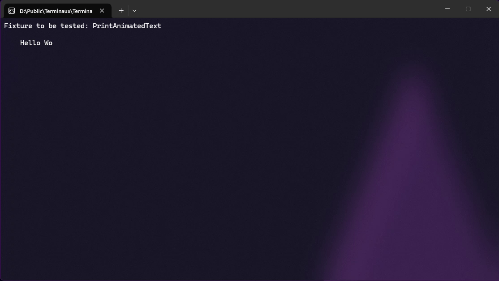

# Text

The following writers write text in different ways to the console.

## Aligned figlet text

This allows you to write an aligned Figlet text to the console.



```csharp
var text = new AlignedFigletText(FigletFonts.GetByName("small"), "Left")
{
    Settings = new()
    {
        Alignment = TextAlignment.Left
    }
};
var text2 = new AlignedFigletText(FigletFonts.GetByName("small"), "Middle")
{
    Settings = new()
    {
        Alignment = TextAlignment.Middle
    }
};
var text3 = new AlignedFigletText(FigletFonts.GetByName("small"), "Right")
{
    Settings = new()
    {
        Alignment = TextAlignment.Right
    }
};
TextWriterRaw.WriteRaw(text.Render());
TextWriterRaw.WriteRaw(text2.Render());
TextWriterRaw.WriteRaw(text3.Render());
```

<figure><figcaption></figcaption></figure>



```csharp
var text = new AlignedFigletText(FigletFonts.GetByName("small"), "Left")
{
    ForegroundColor = ConsoleColors.Red,
    Settings = new()
    {
        Alignment = TextAlignment.Left
    }
};
var text2 = new AlignedFigletText(FigletFonts.GetByName("small"), "Middle")
{
    ForegroundColor = ConsoleColors.Lime,
    Settings = new()
    {
        Alignment = TextAlignment.Middle
    }
};
var text3 = new AlignedFigletText(FigletFonts.GetByName("small"), "Right")
{
    ForegroundColor = ConsoleColors.Blue,
    Settings = new()
    {
        Alignment = TextAlignment.Right
    }
};
TextWriterRaw.WriteRaw(text.Render());
TextWriterRaw.WriteRaw(text2.Render());
TextWriterRaw.WriteRaw(text3.Render());
```

<figure><figcaption></figcaption></figure>



```csharp
var text = new AlignedFigletText(FigletFonts.GetByName("small"), "Left")
{
    Rainbow = true,
    Settings = new()
    {
        Alignment = TextAlignment.Left
    }
};
var text2 = new AlignedFigletText(FigletFonts.GetByName("small"), "Middle")
{
    Rainbow = true,
    Settings = new()
    {
        Alignment = TextAlignment.Middle
    }
};
var text3 = new AlignedFigletText(FigletFonts.GetByName("small"), "Right")
{
    Rainbow = true,
    Settings = new()
    {
        Alignment = TextAlignment.Right
    }
};
TextWriterRaw.WriteRaw(text.Render());
TextWriterRaw.WriteRaw(text2.Render());
TextWriterRaw.WriteRaw(text3.Render());
```

<figure><figcaption></figcaption></figure>



## Aligned text

This allows you to write an aligned text to the console.



```csharp
var text = new AlignedText("Left")
{
    Settings = new()
    {
        Alignment = TextAlignment.Left
    }
};
var text2 = new AlignedText("Middle")
{
    Settings = new()
    {
        Alignment = TextAlignment.Middle
    }
};
var text3 = new AlignedText("Right")
{
    Settings = new()
    {
        Alignment = TextAlignment.Right
    }
};
TextWriterRaw.WriteRaw(text.Render());
TextWriterRaw.WriteRaw(text2.Render());
TextWriterRaw.WriteRaw(text3.Render());
```

<figure><figcaption></figcaption></figure>



```csharp
var text = new AlignedText("Left")
{
    ForegroundColor = ConsoleColors.Red,
    Settings = new()
    {
        Alignment = TextAlignment.Left
    }
};
var text2 = new AlignedText("Middle")
{
    ForegroundColor = ConsoleColors.Lime,
    Settings = new()
    {
        Alignment = TextAlignment.Middle
    }
};
var text3 = new AlignedText("Right")
{
    ForegroundColor = ConsoleColors.Blue,
    Settings = new()
    {
        Alignment = TextAlignment.Right
    }
};
TextWriterRaw.WriteRaw(text.Render());
TextWriterRaw.WriteRaw(text2.Render());
TextWriterRaw.WriteRaw(text3.Render());
```

<figure><figcaption></figcaption></figure>



```csharp
var text = new AlignedText("Left")
{
    Rainbow = true,
    Settings = new()
    {
        Alignment = TextAlignment.Left
    }
};
var text2 = new AlignedText("Middle")
{
    Rainbow = true,
    Settings = new()
    {
        Alignment = TextAlignment.Middle
    }
};
var text3 = new AlignedText("Right")
{
    Rainbow = true,
    Settings = new()
    {
        Alignment = TextAlignment.Right
    }
};
TextWriterRaw.WriteRaw(text.Render());
TextWriterRaw.WriteRaw(text2.Render());
TextWriterRaw.WriteRaw(text3.Render());
```

<figure><figcaption></figcaption></figure>



## Animated text

This allows you to write text with animations using frames to define how the text is going to move.

```csharp
var animatedText = new AnimatedText()
{
    TextFrames =
    [
        "H",
        "He",
        "Hel",
        "Hell",
        "Hello",
        "Hello ",
        "Hello W",
        "Hello Wo",
        "Hello Wor",
        "Hello Worl",
        "Hello World",
        "Hello World!",
        "Hello World!",
        "Hello World!",
        "Hello World!",
        "Hello World!",
        "Hello World!",
        "Hello World!",
        "Hello World!",
        "Hello World!",
        "Hello World!",
        "Hello World!",
        "Hello World!",
        "Hello World!",
        "Hello World ",
        "Hello Worl  ",
        "Hello Wor   ",
        "Hello Wo    ",
        "Hello W     ",
        "Hello       ",
        "Hello       ",
        "Hell        ",
        "Hel         ",
        "He          ",
        "H           ",
        "            ",
    ],
    Left = 4,
    Top = 2,
    Width = 18,
};
for (int i = 0; i < animatedText.TextFrames.Length; i++)
{
    TextWriterRaw.WriteRaw(animatedText.Render());
    Thread.Sleep(100);
}
```

<figure><figcaption></figcaption></figure>

## Bounded text

This allows you to write text with boundaries to the console to allow enough information to fit in a specified width and height. This works either according to lines, or according to column and row of the invisible caret.



```csharp
var text = new BoundedText("This is a bounded text that wraps. This is a bounded text that wraps. This is a bounded text that wraps. This is a bounded text that wraps. This is a bounded text that wraps. This is a bounded text that wraps. This is a bounded text that wraps.")
{
    Settings = new()
    {
        Alignment = TextAlignment.Left
    },
    Width = 30,
    Height = 5,
    Line = 1,
};
var text2 = new BoundedText("This is a bounded text that wraps. This is a bounded text that wraps. This is a bounded text that wraps. This is a bounded text that wraps. This is a bounded text that wraps. This is a bounded text that wraps. This is a bounded text that wraps.")
{
    Settings = new()
    {
        Alignment = TextAlignment.Left
    },
    Width = 30,
    Height = 5,
    Left = 40,
    Line = 2,
};
TextWriterRaw.WriteRaw(text.Render());
TextWriterRaw.WriteRaw(text2.Render());
```

<figure><figcaption></figcaption></figure>



```csharp
var text = new BoundedText("This is a bounded text that wraps. This is a bounded text that wraps. This is a bounded text that wraps. This is a bounded text that wraps. This is a bounded text that wraps. This is a bounded text that wraps. This is a bounded text that wraps.")
{
    Settings = new()
    {
        Alignment = TextAlignment.Left
    },
    Width = 30,
    Height = 5,
    PositionWise = true,
    Column = 5,
    Row = 4,
};
var text2 = new BoundedText("This is a bounded text that wraps. This is a bounded text that wraps. This is a bounded text that wraps. This is a bounded text that wraps. This is a bounded text that wraps. This is a bounded text that wraps. This is a bounded text that wraps.")
{
    Settings = new()
    {
        Alignment = TextAlignment.Left
    },
    Width = 30,
    Height = 5,
    Left = 40,
    PositionWise = true,
    Column = 5,
    Row = 5,
};
TextWriterRaw.WriteRaw(text.Render());
TextWriterRaw.WriteRaw(text2.Render());
```

<figure><figcaption></figcaption></figure>



## Figlet text

This allows you to write unaligned Figlet text to the console.

```csharp
var text = new FigletText(FigletFonts.GetByName("small"), "Figlet text");
TextWriterRaw.WriteRaw(text.Render());
```

<figure><figcaption></figcaption></figure>

## Text marquee

This allows you to write an animated text marquee to the console.

```csharp
var stickScreen = new Screen()
{
    CycleFrequency = 50,
};
var marquee = new TextMarquee(
    "This is the test text marquee that's adjusted to your console width with the margin of 4 from both the " +
    "left and the right side, and is intentionally long to make the text scroll just like how music players " +
    "work.")
{
    Width = ConsoleWrapper.WindowWidth - 8,
};
try
{
    // First, clear the screen
    ColorTools.LoadBack();

    // Then, show the counter
    var stickScreenPart = new ScreenPart();
    stickScreenPart.Position(4, ConsoleWrapper.WindowHeight / 2);
    stickScreenPart.AddDynamicText(marquee.Render);
    stickScreen.AddBufferedPart("Test", stickScreenPart);
    ScreenTools.SetCurrent(stickScreen);
    ScreenTools.SetCurrentCyclic(stickScreen);
    ScreenTools.StartCyclicScreen();
    Input.ReadKey();
}
catch (Exception ex)
{
    InfoBoxModalColor.WriteInfoBoxModal($"Screen failed to render: {ex.Message}");
}
finally
{
    ScreenTools.StopCyclicScreen();
    ScreenTools.UnsetCurrent(stickScreen);
    ColorTools.LoadBack();
}
```

<figure><figcaption></figcaption></figure>

## Decoration

This allows you to create decorative renders for your text, but in a standalone form. You can also use this instance with aligned text instances to decorate your text with prefixes and suffixes.

```csharp
var decoration1 = new Decoration()
{
    ForegroundColor = ConsoleColors.Red,
    Start = "..:: ",
    End = " ::..",
};
var decoration2 = new Decoration()
{
    ForegroundColor = ConsoleColors.Lime,
    Start = "..::",
    End = "::..",
};
var decoration3 = new Decoration()
{
    ForegroundColor = ConsoleColors.Blue,
    Start = "..::",
    End = "::..",
};
TextWriterRaw.WritePlain("Full decoration:  " + decoration1.Render());
TextWriterRaw.WritePlain("Start decoration: " + decoration2.RenderStart());
TextWriterRaw.WritePlain("End decoration:   " + decoration3.RenderEnd() + "\n");

var alignedTextUndecorated = new AlignedText("Aligned text")
{
    ForegroundColor = ConsoleColors.Yellow,
    Top = 6,
    LeftMargin = "Aligned text without decoration: ".Length,
};
var alignedTextDecorated = new AlignedText("Aligned text")
{
    ForegroundColor = ConsoleColors.Yellow,
    UseColors = true,
    Top = 7,
    LeftMargin = "Aligned text without decoration: ".Length,
    Decoration = decoration2,
};
TextWriterRaw.WritePlain("Aligned text without decoration: " + alignedTextUndecorated.Render());
TextWriterRaw.WritePlain("Aligned text with decoration:    " + alignedTextDecorated.Render());
```

<figure><figcaption></figcaption></figure>

## Syntax text

You can render a syntax highlighted snippet of code using this renderable.


Please note that you must have the [`highlight`](http://andre-simon.de/zip/download.php) app installed.


```csharp
var chart = new SyntaxText()
{
	Top = 4,
	LeftMargin = 4,
	Syntax = "rust",
	Text =
		"""
        fn main() {
            // Comment
            println!("Hello World!");
        }
        """
};
TextWriterRaw.WriteRaw(chart.Render());
```

<figure><figcaption></figcaption></figure>

## Text path

You can render the decorated text path with this renderable so that the paths appear more elegant and simplified.

```csharp
var path1 = new TextPath()
{
    PathText = @"C:\WINDOWS\System32\very\long\path\so\that\we\can\read-this.txt",
    Left = 4,
    Top = 2,
    Width = 30,
};
var path2 = new TextPath()
{
    PathText = @"C:\WINDOWS\System32\taskmgr.exe",
    ForegroundColor = ConsoleColors.Green,
    LastPathColor = ConsoleColors.Blue,
    SeparatorColor = ConsoleColors.Yellow,
    RootDriveColor = ConsoleColors.Red,
    UseColors = true,
    Settings = new() { Alignment = TextAlignment.Left },
    Left = 4,
    Top = 4,
    Width = 40,
};
var path3 = new TextPath()
{
    PathText = @"/etc/grub.d/40_custom",
    ForegroundColor = ConsoleColors.Green,
    LastPathColor = ConsoleColors.Blue,
    SeparatorColor = ConsoleColors.Yellow,
    RootDriveColor = ConsoleColors.Red,
    UseColors = true,
    Settings = new() { Alignment = TextAlignment.Middle },
    Left = 4,
    Top = 5,
    Width = 40,
};
var path4 = new TextPath()
{
    PathText = @"Source/Public/Terminaux",
    ForegroundColor = ConsoleColors.Green,
    LastPathColor = ConsoleColors.Blue,
    SeparatorColor = ConsoleColors.Yellow,
    RootDriveColor = ConsoleColors.Red,
    UseColors = true,
    Settings = new() { Alignment = TextAlignment.Right },
    Left = 4,
    Top = 6,
    Width = 40,
};
TextWriterRaw.WriteRaw(path1.Render());
TextWriterRaw.WriteRaw(path2.Render());
TextWriterRaw.WriteRaw(path3.Render());
TextWriterRaw.WriteRaw(path4.Render());
```

<figure><figcaption></figcaption></figure>
