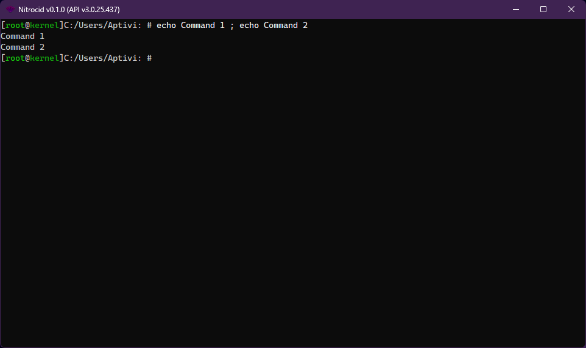
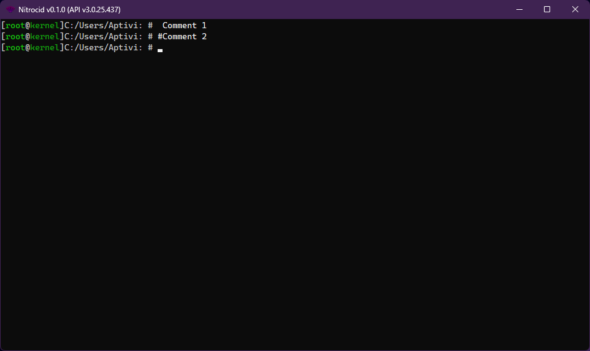
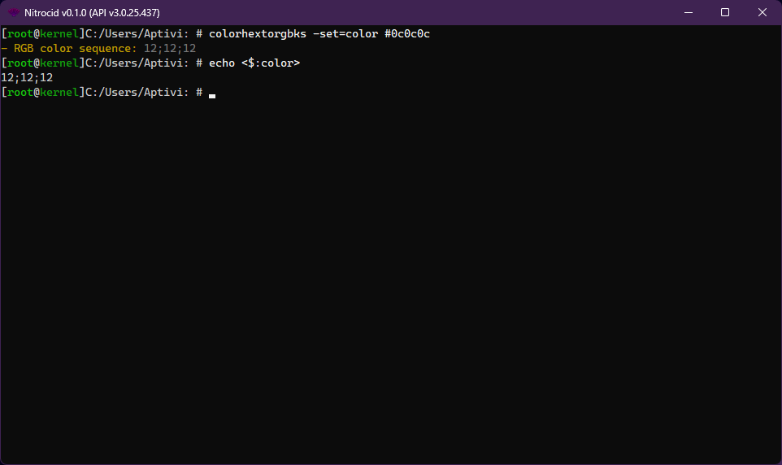

# Command Parsing

Once the `GetLine()` function gets your input, it attempts to split any command with the semicolon between them, like:

```
command1 arg1 arg2 ; command2 arg3 arg4
```

<figure><figcaption></figcaption></figure>

Any command that starts with either a space or a hashtag will be ignored as a comment, like: (Notice the extra space in the first comment)

```
 comment
#comment
```

<figure><figcaption></figcaption></figure>

The first word is a command, and all words following it in a single command text are the series of arguments. These words then get split to arguments (without the switch indicator `-switch`) and switches (arguments that come after the dash) using the `ProvidedArgumentsInfo` class, though it does much more than that.

This class contains these variables:

* `Command`: Target command
* `ArgumentsText`: Provided arguments and switches
* `ArgumentsList`: Array of arguments without the switches
* `SwitchesList`: Array of switches
* `RequiredArgumentsProvided`: Checks to see if the arguments are provided or not
* `RequiredSwitchesProvided`: Checks to see if the required switches are provided or not
* `RequiredSwitchArgumentsProvided`: Checks to see if the required switch arguments are provided or not

After the above class constructor is called, the shell attempts to execute a mod or alias command, if found. Else, the built-in command is going to be executed. It checks for these redirection flags:

* `>>`: Redirects the output to a file, overwriting the target file, such as `command >> target.txt`.
* `>>>`: Redirects the output to a file, appending to the target file, such as `command >>> target.txt`.
* `|SILENT|`: Redirects the output to a null console driver, which means no output, such as `command |SILENT|`.

If these flags are found, the shell sets the console driver as appropriate.

Finally, the command executor thread is fired up with the `ExecuteCommandParameters` instance to hold command execution parameters for the same thread. The thread is then started.

However, the command executor checks for these:

* If the provided command is an MESH script, the shell invokes a script executor.
* If the command is an external program found in the shell lookup path, which is usually `$PATH`, the shell attempts to scan these directories for the program and execute it.
* If the command is an internal command, it creates a separate thread for the command.

The `ExecuteCommandWrapped()` function allows you to execute a command in wrapped mode from your mod commands. However, your mods must execute a command that has one of the flags, called `CommandFlags.Wrappable`, otherwise, this function prints the list of wrappable commands.

## Command-line Arguments

The command-line arguments feature is backported from Nitrocid KS with more customization in place. This allows you to create a console application that handles arguments deeply, such as support for argument values.

To parse the arguments, you'll have to define a statically defined dictionary in a static class with a type of `Dictionary<string, ArgumentInfo>`, given that `ArgumentInfo` can be constructed with the following:

* `Argument`: The argument name that users will have to write down
* `HelpDefinition`: The description of the argument that will be shown in the help renderer
* `ArgArgumentInfo`: An array of argument info instances that will modify its behavior
* `ArgumentBase`: An argument executor instance that holds the actual code for the argument
* `Obsolete`: Whether this argument is obsolete or not

Afterwards, you can use the `ParseArguments()` function somewhere in the main application code. You can find the relevant classes in the `Terminaux.Shell.Arguments.Base` namespace.

## Switch Management

You can know more about switch management by clicking on the below button:


[command-switches.md](command-switches.md)


### Local Variables and Commands

<figure><figcaption></figcaption></figure>

Occasionally, you may run into conditions where you may have to set an environment variable locally before running a command. For example, on your Linux system, if you run a VNC server running on display `:1` and you want to show a GUI application there from the terminal emulator, you'll have to run the command like this:

```shell-session
$ DISPLAY=:1 x_gui_app
```

The same thing can be done for local shell commands on Nitrocid, but the syntax is slightly different. You can assign local environment variables before running the command either by using the `set` command, which affects both the current and the future command runs, or you can limit it to just the command that you're going to run using the below syntax:

```
($env=value $env2="value with space") my_mod_command
```

### Special characters

<figure><figcaption></figcaption></figure>

If a command, such as `wrap`, is set to use the arguments string, you can escape special characters, as long as these characters are known. For example, if you want to pass a switch to a wrapped command, you can use the `wrap` command like this:

```
wrap help \-addon
```

### `-set` switch property

<figure><figcaption></figcaption></figure>

Your commands can now change their behavior, depending on if the `-set` switch was passed to the command. You can use the `parameters.SwitchSetPassed` value just like below:


```csharp
if (!parameters.SwitchSetPassed)
{
    TextWriters.Write(Translate.DoTranslation("You must pass the -set switch with the variable that you want to set this value to."), KernelColorType.Error);
    return KernelExceptionTools.GetErrorCode(KernelExceptionType.ShellOperation);
}
```

