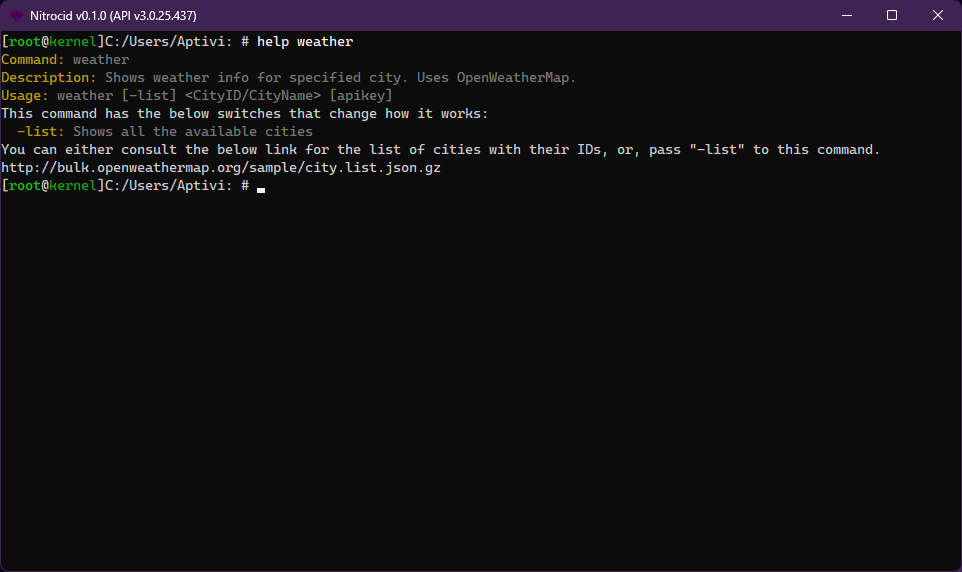

# Command Switches

The command switches function is split into two categories, which is switch management and switch information definition.

## Switch management

There is a static class dedicated to managing the switches, called `SwitchManager`. It allows you to manage the switches with the values. There are two functions that specialize in getting the switch values: `GetSwitchValues()` and `GetSwitchValue()`.

The first function returns the list of switches with their values stored in a tuple, and the second function returns the switch value for a specified switch or a blank value if not found.


You can always use these functions with the `SwitchesOnly` array found in the `Execute()` function in the `CommandBase` class.


The switches can be set to conflict with each other by passing an array of incompatible switches to the `SwitchInfo` constructor, specifically the last parameter, `conflictsWith`. However, each switch to be conflicted must set their `conflictsWith` arrays to the opposing switches.

<figure><figcaption></figcaption></figure>

For example, if you want a command to have three switches (`-s`, `-t`, `-u`) that conflict with each other, you can specify three `SwitchInfo` instances with the following properties (assuming that you've already set the `HelpDefinition`, `IsRequired`, and `ArgumentsRequired` parameters):

* `-s`
  * Switch: `s`
  * ConflictsWith: `new string[] { "t", "u" }`
* `-t`
  * Switch: `t`
  * ConflictsWith: `new string[] { "s", "u" }`
* `-u`
  * Switch: `u`
  * ConflictsWith: `new string[] { "s", "t" }`


You may only specify the switch names without the dash in the `Switch` argument and the `ConflictsWith` argument.



Be sure that you put all the conflicts in the above form for each conflicting `SwitchInfo`. Failure to do this may cause the MESH shell to believe that they don't conflict, while they do. For example, we have an edit command that contains three conflicting switches (`-json`, `-hex`, and `-text`) that is implemented below:


```csharp
{ "edit",
    new CommandInfo("edit", /* Localizable */ "Edits a file",
        new[] {
            new CommandArgumentInfo(new[]
            {
               new CommandArgumentPart(true, "file"),
            }, new[] {
                new SwitchInfo("text", /* Localizable */ "Forces text mode", false, false, new string[] { "hex", "json", "sql" }, 0, false),
                new SwitchInfo("hex", /* Localizable */ "Forces hex mode", false, false, new string[] { "text", "json", "sql" }, 0, false),
                new SwitchInfo("json", /* Localizable */ "Forces JSON mode", false, false, new string[] { "text", "hex", "sql" }, 0, false),
                new SwitchInfo("sql", /* Localizable */ "Forces SQL mode", false, false, new string[] { "text", "hex", "json" }, 0, false),
            })
        }, new EditCommand())
},
```



The switches can also be set not to accept any value by setting the `AcceptsValues` argument to `false`. It will cause parsing to fail once the value in such switches are encountered, stating that such switches don't accept any value.

As for the switches that cause some or all arguments to be omittable (optional), you can indicate so in the constructor of your switch. The `optionalizeLastRequiredArguments` argument in the constructor specifies how many arguments are going to be made optional starting from the last argument in the list.

For example, if this parameter was set to 1 and you've defined three required arguments, which are named below:

* `Arg1`
* `Arg2`
* `Arg3`

Then, this will set `Arg3` to be omittable, which means that the user doesn't have to set the value for this argument in order for the command to execute.


A real-world example is the `weather` command. It contains a switch, `-list`, which omits the last 2 arguments, which causes this command to be executable with just `weather -list`. Its `SwitchInfo` is defined below:

```csharp
new SwitchInfo("list", "Shows all the available cities", false, false, null, 2, false)
```


Additionally, you can set your switches to only accept numeric values as the switch value when executing commands that contain such switches. When the shell detects that the non-numeric value is provided to such switches, the shell will print an error message. This is how you can define such switch:

<pre class="language-csharp"><code class="lang-csharp">new SwitchInfo("columns", /* Localizable */ "Specifies the columns per line", new SwitchOptions()
{
    ArgumentsRequired = true,
<strong>    IsNumeric = true
</strong>})
</code></pre>

In addition to these features, you can now also check the specific switch value to see if that value is numeric or not. That means it's checking to see if it's a number (as in either positive numbers or negative numbers) or a number with decimals (as in numbers that have decimals, separated by a dot).

The function to perform this check on a specific switch is `IsSwitchValueNumeric()`, which you can call using the following signature:


```csharp
public static bool IsSwitchValueNumeric(string[] switches, string switchKey)
```


## Switch information definition

For `SwitchInfo` instances, consult the below constructors to create an array of `SwitchInfo` instances when defining your commands:

```csharp
public SwitchInfo(string Switch, string HelpDefinition)
public SwitchInfo(string Switch, string HelpDefinition, SwitchOptions options)
public SwitchInfo(string Switch, string HelpDefinition, bool IsRequired = false, bool ArgumentsRequired = false, string[] conflictsWith = null, int optionalizeLastRequiredArguments = 0)
```


You can access the switch options using the `Options` property. The existing properties, like `IsRequired`, are proxies to that property, but are to stay for compatibility.

Try to use the second overload if you want to specify the options, if possible. This allows you to be more expressive in your mod command definition code, making it more readable.

