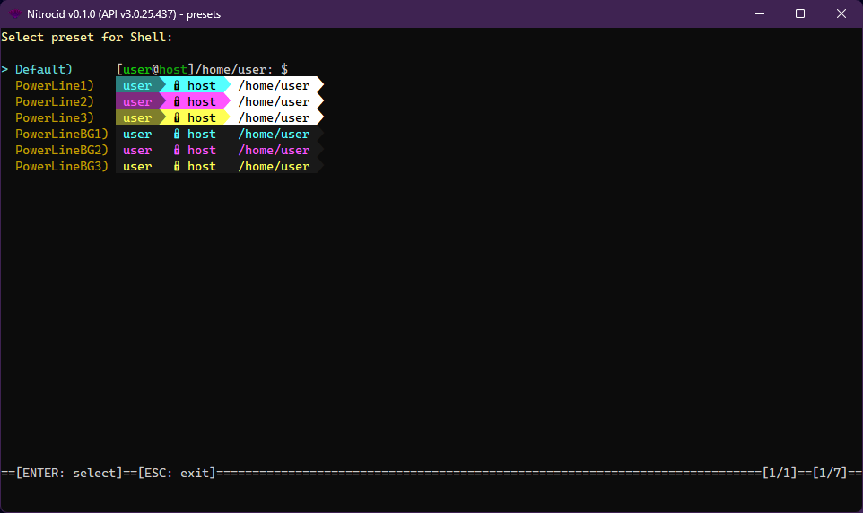

# Shell Presets

<figure><figcaption></figcaption></figure>

While `ShellManager.GetLine()` prompts for input, it decides which shell preset, `PromptPresetBase`, is used according to the list of presets, `ShellPresets`, that **should** make a new prompt preset class that you made for your shell.

`CurrentPreset` specifies the current `PromptPresetBase` class, which is usually found in the `ShellPresets` list. It usually calls the `PromptPresetManager.CurrentPresets[ShellType]` variable.


The first preset **should** implement a preset called `Default` in the `ShellPresets` dictionary.


`PromptPresetManager.SetPreset()` queries both the shell pre-defined presets, `ShellPresets`, and the custom presets, `CustomShellPresets`. After that, it sets the preset to the specified preset in the internal `CurrentPresets`.

Every preset must implement a base class, `PromptPresetBase` and `IPromptPreset`, as in below:

```csharp
public class YourDefaultPreset : PromptPresetBase, IPromptPreset
```

The only essential values that you **must** override in your shell preset class are:

* `PresetName`: **Read-only property.** The shell preset name. If this preset is your first preset, it must be `Default`.

```csharp
public override string PresetName { get; } = "Default";
```

* `PresetPrompt`: **Read-only property.** Usually calls the overridable internal function `PresetPromptBuilder()`. If it's simple, overriding it with a string is enough.

```csharp
public override string PresetPrompt =>
    PresetPromptBuilder();
internal override string PresetPromptBuilder()
```

Optionally, these variables can be overridden:

* `PresetPromptCompletion`: **Read-only property.** Usually calls the overridable internal function `PresetPromptCompletionBuilder()`. If it's simple, overriding it with a string is enough.

```csharp
public override string PresetPromptCompletion =>
    PresetPromptCompletionBuilder();
internal override string PresetPromptCompletionBuilder()
```

* `PresetPromptShowcase`: **Read-only property.** Usually calls the overridable internal function `PresetPromptBuilderShowcase()`. If it's simple, overriding it with a string is enough.

```csharp
public override string PresetPromptShowcase =>
    PresetPromptBuilderShowcase();
internal override string PresetPromptBuilderShowcase()
```

* `PresetPromptCompletionShowcase`: **Read-only property.** Usually calls the overridable internal function `PresetPromptCompletionBuilderShowcase()`. If it's simple, overriding it with a string is enough.

```csharp
public override string PresetPromptCompletionShowcase =>
    PresetPromptCompletionBuilderShowcase();
internal override string PresetPromptCompletionBuilderShowcase()
```


Since the `Showcase` versions of the properties are meant to simulate how the preset would look in the real-world, you shouldn't try to access any external asset, especially those that the non-showcase properties use.

The easiest way to avoid using these assets is to make up things, such as `database.sqlite` for the SQL shell.

